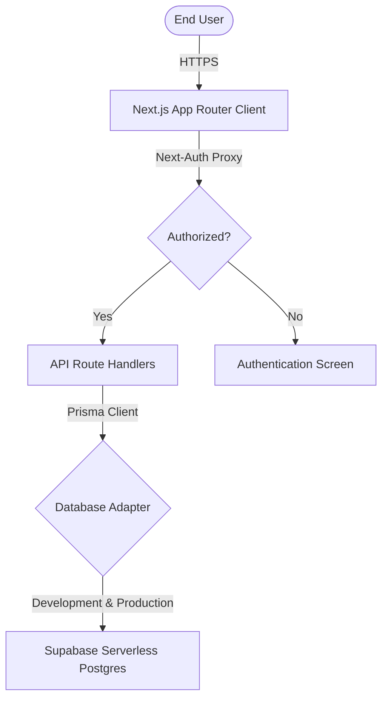

# rubric.

> A premium, minimalist academic term scheduler, daily attendance logger, and journal memo manager.

---

## 📖 Introduction

**Rubric** is a highly polished, responsive dashboard designed for students and educators to organize academic terms, track attendance percentages against custom target thresholds, and log journal entries for each lecture. 

Inspired by modern editorial clay design aesthetics, Rubric pairs minimalist typography with clean matte layouts to create a visually satisfying and highly interactive personal workspace.

##### **Deployed At:** [https://rubric-core.vercel.app](https://rubric-core.vercel.app)
---

## 🛠 Tech Stack

- **Core Framework:** Next.js 16 (App Router with Turbopack)
- **Database & Query Layer:** Prisma ORM, PostgreSQL via Supabase
- **Authentication:** Next-Auth (JWT Strategy with encrypted Credentials provider)
- **Layout & Styling:** Vanilla CSS Modules with HSL warm-charcoal variables, Framer Motion transitions, Lucide React icon packs

## 🏗 System Architecture

---

## ✨ Features

### 📅 Term & Academic Session Initialization
- Sandboxed terms (semesters) that isolate course structures, attendance logs, and calculators.
- Define custom **standard class durations** (e.g., 50-minute periods) to automatically calculate session weights for double classes or laboratory hours.

### 🎨 Subject Configuration
- Create and organize courses with custom color-coding palettes.
- Real-time calculations of current attendance percentages and safety warnings (tells you how many classes you must attend/can afford to miss to stay above your target percentage).

### ✍ Daily Class Logging & Collision Detection
- Log class status instantly (`ATTENDED`, `MISSED`, `CANCELLED`).
- Save journal entries/memos summarizing lessons, assignments, or notes.
- **Timing Collision Warning:** Real-time validation checks for timing overlaps to prevent scheduling two classes during the same hours.

### 📊 Comprehensive History Audit
- Toggle view layouts between a detailed, sortable spreadsheet table and clean card grids.
- Slide-out details drawer to dynamically edit, delete, or review individual historical logs.

### 🔒 Secure Authentication & Auto-Login
- Bcrypt-hashed password storage.
- Auto-login on successful registration that redirects users straight to the dashboard or session setup.

---

## 📦 Database Schema

The database utilizes four core relational entities defined in the [Prisma Schema](prisma/schema.prisma):

- **`User`**: Account authentication credentials and session relationships.
- **`Session`**: Grouping entity representing academic semesters or terms.
- **`Subject`**: Course listings under a session, tracking target rates and custom coloring codes.
- **`AttendanceRecord`**: Historical logs containing dates, timing slots, attendance status, and journal memos.
