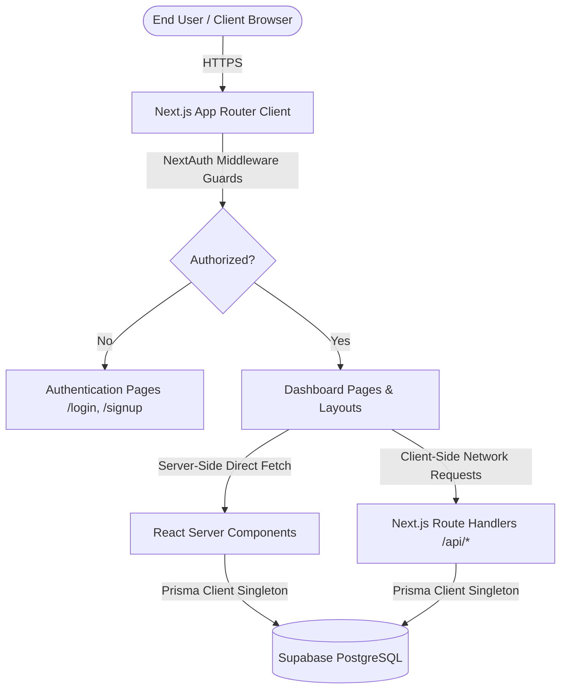
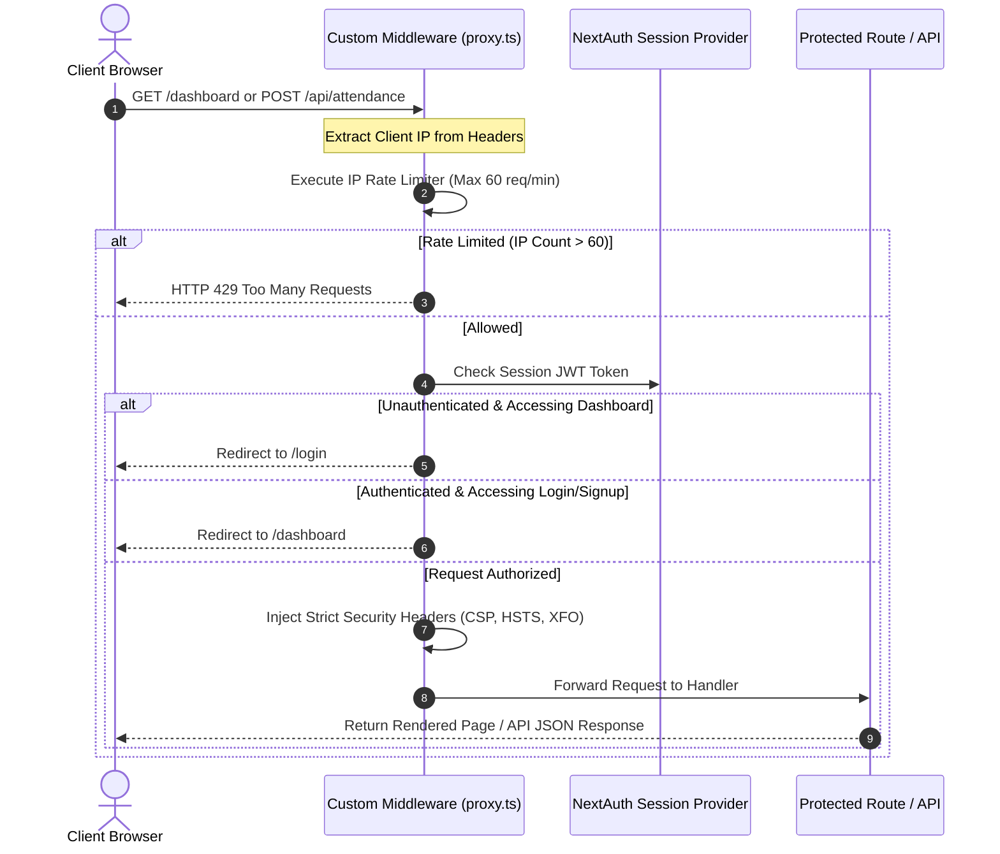
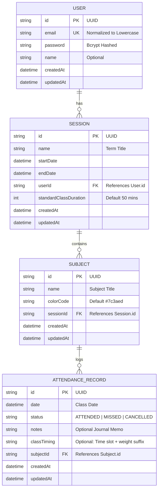

# Rubric - Project Technical Documentation

Rubric is a highly polished, responsive web application designed for students and educators to organize academic terms, track course attendance against custom target thresholds, and log detailed journal entries for each class session. The application features a minimalist clay-inspired design aesthetic, pairing clean typography with a matte design layout to create an immersive and highly interactive personal workspace.

This document serves as the comprehensive technical guide to the Rubric platform, outlining its technology stack, system architecture, database schema, security features, component design, and frontend optimization techniques.

---

## 1. Technology Stack

The Rubric platform is built on a modern, type-safe web stack optimized for performance, security, and developer experience.

| Layer | Technology | Version / Details | Purpose |
| :--- | :--- | :--- | :--- |
| **Framework** | Next.js | `^16.2.9` (App Router) | Core React framework, routing, and server-side rendering (SSR/RSC). |
| **Library** | React | `19.2.4` | Component-based user interface rendering. |
| **Database ORM** | Prisma | `^7.8.0` | Type-safe database queries and migration management. |
| **Database** | PostgreSQL | Hosted on Supabase | Relational database management system. |
| **DB Driver** | `pg` (node-postgres) | `^8.22.0` | Node.js client for PostgreSQL. |
| **Connection Adapter**| `@prisma/adapter-pg` | `^7.8.0` | Enables Prisma to utilize connection pooling via `pg`'s `Pool`. |
| **Authentication** | NextAuth.js | `^4.24.14` | Secure session management, route guards, and credential provider. |
| **Styling** | Vanilla CSS Modules | CSS Variables & custom properties | Scoped component styling with HSL-based style tokens. |
| **Animation** | Framer Motion | `^12.40.0` | Smooth UI transitions, sliders, and micro-interactions. |
| **Icons** | Lucide React | `^1.21.0` | Premium, minimalist vector outline icons. |
| **Security** | `bcryptjs` | `^3.0.3` | Cryptographic hashing for passwords. |
| **Language** | TypeScript | `^5` | Static typing and compile-time verification. |

---

## 2. System Architecture & Coding Flowcharts

### 2.1 High-Level System Architecture

The following diagram illustrates the structural relationships between the client browser, NextAuth gateway, server-side API routes, Prisma ORM, and the PostgreSQL database.



### 2.2 User Request Lifecycle (Authentication & Security Guards)

This flowchart traces a request's path through the custom edge middleware configured in `src/proxy.ts`.



### 2.3 Attendance Logging & Overlap Detection Flow

When a user logs a class, the application executes multi-stage validation checks on both the client and server before committing to the database.

```mermaid
flowchart TD
    Start[User Clicks 'Log Class'] --> Val1{Is Status 'CANCELLED'?}
    
    Val1 -->|Yes| Commit[Commit to DB via Prisma]
    
    Val1 -->|No| Val2{Are Start & End Times Entered?}
    Val2 -->|No| Error1[Show Error: Times Required]
    
    Val2 -->|Yes| Val3{Is End Time > Start Time?}
    Val3 -->|No| Error2[Show Error: End must be after Start]
    
    Val3 -->|Yes| Val4{Is Duration <= 5 Hours?}
    Val4 -->|No| Error3[Show Error: Cannot exceed 5 hours]
    
    Val4 -->|Yes| Val5{Are there overlapping classes on this day?}
    Val5 -.- OverlapMath["Overlap Math: newStart < extEnd && extStart < newEnd"]
    
    Val5 -->|Yes| Error4[Show Error: Time slot overlaps with existing class]
    
    Val5 -->|No| CalcWeight[Calculate Class Weight: Math.round(Duration / StandardDuration)]
    CalcWeight --> CheckOverride{User Custom Override?}
    
    CheckOverride -->|Yes| ApplyOverride[Apply Custom Weight Suffix |w:X]
    CheckOverride -->|No| ApplyCalc[Apply Calculated Weight Suffix]
    
    ApplyOverride --> Commit
    ApplyCalc --> Commit
    
    Commit --> Success[Reactively Update Local State & Close Modal]
```

---

## 3. Database Schema

The database utilizes four core relational entities defined in the [Prisma Schema](prisma/schema.prisma) and stored in a PostgreSQL database. 



### 3.1 Entity Reference Table

#### `User`
Tracks user accounts and authentication credentials.
- **Constraints**: `email` is enforced as `@unique` and normalized to lowercase on the server.
- **Relations**: One-to-many relationship with `Session`.

#### `Session`
Represents isolated academic terms or semesters (e.g., "Fall Semester 2026").
- **Fields**:
  - `standardClassDuration` (Integer, default `50`): Defines the base length in minutes of a single class slot.
- **Indexes**: `@@index([userId])` optimizes retrieval of sessions belonging to a specific user.
- **Relations**: Belongs to `User`. Cascades delete to `Subject`s.

#### `Subject`
Represents courses enrolled during a specific academic session.
- **Fields**:
  - `colorCode` (String, default `#7c3aed`): Custom hex code for UI accenting.
- **Indexes**: `@@index([sessionId])` optimizes fetching course lists for an active term.
- **Relations**: Belongs to `Session`. Cascades delete to `AttendanceRecord`s.

#### `AttendanceRecord`
Stores the actual logs and diary entries for each class.
- **Fields**:
  - `status`: String restricted to `"ATTENDED"` (Present), `"MISSED"` (Absent), or `"CANCELLED"` (No Class).
  - `classTiming`: Stores the formatted time interval and custom weight parameters, e.g., `"09:00 AM – 09:50 AM|w:2"`.
- **Indexes**:
  - `@@index([date])` optimizes sorting and calendar-based queries.
  - `@@index([subjectId])` optimizes stats aggregation.
- **Relations**: Belongs to `Subject`.

### 3.2 Referential Integrity (Cascade Deletes)
To ensure the database remains free of orphaned records, relations are configured with `onDelete: Cascade` at the database level:
- Deleting a `User` automatically deletes all their `Session` records.
- Deleting a `Session` deletes all its associated `Subject` records.
- Deleting a `Subject` deletes all its associated `AttendanceRecord` logs.

This enforces strict relational integrity directly inside PostgreSQL.

---

## 4. PostgreSQL & Prisma ORM Implementation

### 4.1 Why PostgreSQL?
PostgreSQL was selected for its robust support for relational schemas, strict ACID compliance, and strong index optimization capabilities. It ensures that critical relations (such as linking attendance logs to specific subjects within a term) remain consistent. The database is hosted on Supabase, which provides high-performance serverless connection management.

### 4.2 Prisma ORM Role
Prisma acts as the object-relational mapper (ORM), translating database tables into type-safe TypeScript interfaces. This guarantees compile-time check validation on database queries and prevents syntax errors in database transactions.

### 4.3 Database Connection Pooling & The Singleton Pattern
In serverless environments like Next.js, files are hot-reloaded during development, and API routes spin up serverless containers dynamically. A naive instantiation of a database client like `new PrismaClient()` on every request would quickly exhaust PostgreSQL's connection limits.

To prevent this connection leakage, Rubric implements a **Global Singleton Pattern** in `src/lib/prisma.ts`:

```typescript
import { PrismaClient } from '@prisma/client';
import { PrismaPg } from '@prisma/adapter-pg';
import { Pool } from 'pg';

const globalForPrisma = globalThis as unknown as { 
  prisma?: PrismaClient;
  pgPool?: Pool;
};

const getPrismaInstance = () => {
  const dbUrl = process.env.DATABASE_URL || "";
  if (!dbUrl) {
    throw new Error("DATABASE_URL is not defined in environment variables.");
  }

  // Reuse the pg connection Pool across hot-reloads
  if (!globalForPrisma.pgPool) {
    globalForPrisma.pgPool = new Pool({ connectionString: dbUrl });
  }
  const adapter = new PrismaPg(globalForPrisma.pgPool);
  return new PrismaClient({ adapter });
};

export const prisma = globalForPrisma.prisma || getPrismaInstance();

if (process.env.NODE_ENV !== 'production') globalForPrisma.prisma = prisma;
```

#### Key Elements:
1. **Connection Pooling (`pg.Pool`)**: Establishes a persistent queue of reusable database connections.
2. **Serverless Adapter (`@prisma/adapter-pg`)**: Integrates the standard Node-Postgres connection pool directly into the Prisma Client instance.
3. **Global Scope Binding (`globalThis`)**: Prevents recreating the pool and ORM client during hot reloads in development mode.

---

## 5. Security Architecture

Rubric implements a zero-trust security architecture on both database and application levels to safeguard user data.

### 5.1 Cryptographic Password Security
Cleartext passwords are never processed by the database.
- **Registration**: Passwords are encrypted using `bcryptjs` with **10 salt rounds** in `/api/auth/register`.
- **Password Updates**: Changing a password via `/api/user` requires validating the current password against the stored hash. The new password is then encrypted with **12 salt rounds** for enhanced protection against brute-force attacks.
- **Safe Payload Serialization**: Hashed passwords are explicitly stripped from the JSON objects returned by the API during registration or profile updates.

### 5.2 NextAuth Session & JWT Guarding
All user sessions are secured using JWT (JSON Web Tokens) signed with a server-side secret (`NEXTAUTH_SECRET`). The user's database UUID is embedded into the token payload at login. 
All API endpoints (sessions, subjects, attendance) extract this ID using `getServerSession(authOptions)` and append it to SQL queries. This prevents ID-spoofing and ensures users can only access, modify, or delete resources they own.

### 5.3 Custom Edge Middleware Security Gateway (`src/proxy.ts`)
A custom middleware interceptor acts as the application's entry gateway, implementing several security measures:

#### 1. In-Memory Rolling IP Rate Limiter
To prevent brute-force login attempts and denial-of-service (DDoS) requests on authentication and database-heavy API endpoints, the middleware implements a rolling IP rate limiter:
- **Limit**: Max 60 requests per 1-minute window.
- **Resiliency**: Utilizes an in-memory cache (`Map`) compatible with edge execution.
- **Memory Optimization**: Employs a garbage collection strategy (1% chance on each request) to prune expired cache records, keeping memory usage constant.
- **HTTP Response**: Exceeding limits returns a `429 Too Many Requests` status with a `Retry-After: 60` header.

#### 2. Strict Content Security Policy (CSP)
To prevent Cross-Site Scripting (XSS) and code injection attacks, a strict CSP is injected into every response header:
- `default-src 'self'`: Disallows loading assets from external servers by default.
- `script-src 'self' 'unsafe-inline'`: Blocks execution of unapproved scripts. In development mode, `'unsafe-eval'` is appended to allow Hot Module Replacement (HMR).
- `style-src 'self' 'unsafe-inline' https://fonts.googleapis.com`: Restricts stylesheets to local files and Google Fonts.
- `img-src 'self' blob: data:`: Authorizes loading local images and inline data.
- `object-src 'none'`: Completely blocks browser plugins like Flash or Java.
- `frame-ancestors 'none'`: Prevents clickjacking by disabling embedding the app in an external frame or iframe.

#### 3. Standard Hardening Headers
The middleware sets several HTTP security headers on all responses:
- `X-Frame-Options: DENY`: Restricts the page from being displayed in a frame, protecting against Clickjacking.
- `X-Content-Type-Options: nosniff`: Instructs the browser to adhere strictly to the declared MIME types, preventing MIME-type sniffing exploits.
- `Referrer-Policy: strict-origin-when-cross-origin`: Controls how much referrer information is passed on outgoing requests.
- `Strict-Transport-Security (HSTS)`: Enforces HTTPS connections for 2 years (`max-age=63072000`), including all subdomains, with preloading enabled.
- `Permissions-Policy`: Hardens user privacy by disabling browser access to hardware APIs (`camera=()`, `microphone=()`, `geolocation=()`).

---

## 6. Component Catalog & Architecture

The user interface is built as a set of modular, single-responsibility React components located in `src/components`.

### 6.1 Layout Components
- **`Sidebar.tsx`**: The main navigation portal. Features responsive layout configurations, highlights active routes, displays user account metadata, and houses navigation anchors for the dashboard, history, and account settings.

### 6.2 Dashboard Components (`src/components/dashboard`)
- **`DashboardClient.tsx`**: The primary state manager for the main view. Houses local states for sessions, subjects, and logs, and handles reactive state synchronization upon CRUD events.
- **`SubjectList.tsx`**: Renders course cards utilizing a physical "folder-tab" visual design.
  - **Analytics**: Calculates total classes, presents, absents, and current attendance percentage for each course.
  - **Safety Advisories**: Displays status alerts ("On Track (≥75%)" or "Below Limit (<75%)") to guide student attendance decisions.
  - **Inline Editing**: Allows instant editing of course names and color-coding codes, or course deletion.
- **`Calendar.tsx`**: Displays a custom monthly calendar grid.
  - **Heatmap Indicators**: Maps attendance records to corresponding days and displays up to 4 colored dots representing logged classes. Dot colors match the subject's theme color if attended, turn Rust Red if missed, and default to Muted Gray if cancelled.
- **`DailyLogger.tsx`**: The manual class entry interface.
  - **Micro-Interactions (Vibe Tags)**: Provides clickable buttons ("📝 Focus", "⚡ Energy", "😴 Tired", "☕ Chill") that instantly append contextual mood tags to the class notes field.
  - **Equivalent Class Weight Calculator**: Computes the class duration based on user-entered start and end times. It automatically divides this duration by the session's standard class length and suggests a relative weight (e.g. a 90-minute lecture in a 50-minute standard session counts as 2 classes), allowing the user to override this value.
- **`LoggedClasses.tsx`**: Displays a timeline of classes logged for the selected calendar day, allowing users to review details or delete logs.

### 6.3 History Audit Components (`src/components/history`)
- **`HistoryClient.tsx`**: The central controller for the audit trail.
  - **Multi-faceted Filtering**: Features a search bar (filters by subject title and journal memo text), a subject filter dropdown, and an attendance status filter dropdown.
  - **Layout Toggle**: Allows users to switch the UI representation between a spreadsheet table and card grids.
- **`HistoryTable.tsx`**: Renders logs in a structured spreadsheet-like grid, optimized for desktop screens.
- **`HistoryGrid.tsx`**: Renders logs as descriptive card decks, optimized for mobile devices.
- **`HistoryDrawer.tsx`**: A drawer panel that slides in from the screen edge.
  - **CRUD & Validations**: Provides editing forms for date, subject, status, start/end timings, and notes. It performs full time-collision validation checks locally and reactively syncs updates back to the main history table.

### 6.4 Account Components (`src/components/account`)
- **`AccountClient.tsx`**: The control center for administrative actions. Organized into four sub-panels:
  - *Profile Info*: Update display names.
  - *Security*: Change passwords with validation.
  - *Manage Terms*: Create new academic sessions or delete old terms.
  - *Danger Zone*: Allows users to permanently scrub their account and all associated records from the PostgreSQL database (requiring typing `"DELETE"` to confirm).

---

## 7. Frontend Performance & UX Optimization Techniques

Rubric uses several modern web techniques to ensure rapid load times, smooth rendering, and an engaging user experience.

### 7.1 React Server Components (RSC) & Direct Prefetching
Rather than serving blank HTML files and fetching data via client-side `useEffect` hooks—which causes layout shifts and loading spinners—Rubric utilizes Next.js Server Components (`src/app/dashboard/page.tsx`, `/history/page.tsx`, etc.):
- **Database Fetching**: Server components query PostgreSQL directly using Prisma at the request level.
- **Props Serialization**: Date objects are serialized into ISO strings at the server boundary before being passed to client components.
- **Result**: Pre-rendered HTML is served to the client with data already populated. This reduces the First Contentful Paint (FCP) and Largest Contentful Paint (LCP) times.

### 7.2 Optimistic Client-Side State Synchronization
To make the application feel fast and responsive, client-side actions do not wait for database round-trips to update the UI:
- **Reactive State Updates**: Creating a subject, logging attendance, or deleting a record instantly updates the local React state array. The UI reflects the change immediately.
- **Background Persistence**: The fetch request to the API runs in the background. If a server-side validation error occurs, the state is rolled back and an error banner is displayed.

### 7.3 Native Browser View Transitions API
Rubric implements seamless cross-page morphing animations between navigation routes using the browser's native **View Transitions API**:
- **Next.js Integration**: Enabled via the `experimental.viewTransition` flag in `next.config.ts`.
- **CSS Animations**: Custom keyframe animations in `globals.css` animate page transitions, fading out old content and sliding in new content.
- **Accessibility (A11y)**: Respects user accessibility preferences by wrapping transition animations in a `@media (prefers-reduced-motion: reduce)` media query, disabling animations for users who prefer reduced motion.

```css
@media (prefers-reduced-motion: reduce) {
  ::view-transition-old(*),
  ::view-transition-new(*),
  ::view-transition-group(*) {
    animation-duration: 0s !important;
    animation-delay: 0s !important;
  }
}
```

### 7.4 Progressive Web App (PWA) Integration
Rubric is configured as a fully installable Progressive Web App (PWA) via a Next.js metadata manifest router (`src/app/manifest.ts`):
- **Standalone Display**: Configured as `display: "standalone"` to hide browser chrome and URL bars when launched from a user's home screen.
- **Theming**: Tailors the interface using dedicated theme and background HSL colors (`#121111` and `#c96f53`) to match the editorial clay design aesthetic.
- **Asset Masking**: Supports multi-resolution icons (`192x192` and `512x512`) with `maskable` and `any` properties for adaptive display on various mobile launchers.

### 7.5 CSS Modules & HSL Token Design System
- **CSS Modules**: Using `[name].module.css` files ensures styles are locally scoped to their respective components, avoiding global stylesheet leakage and keeping CSS bundle sizes minimal.
- **HSL Color Variables**: Styling is driven by HSL (Hue, Saturation, Lightness) custom variables. Using HSL values enables simple opacity adjustments (e.g. `hsla(var(--accent-primary-hsl), 0.1)`) and cohesive color relationships across the entire application.
